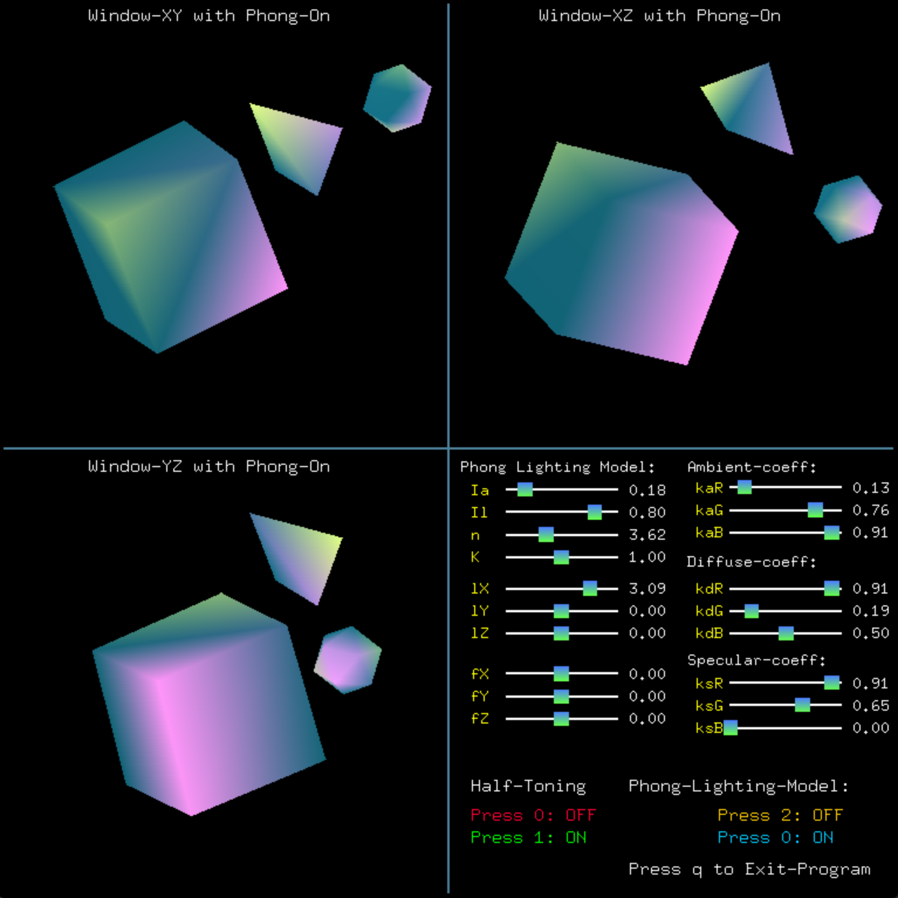
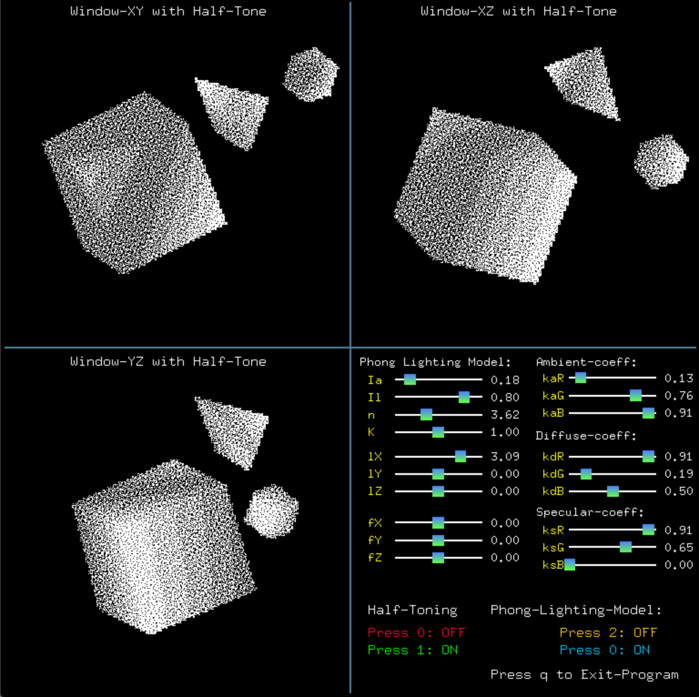
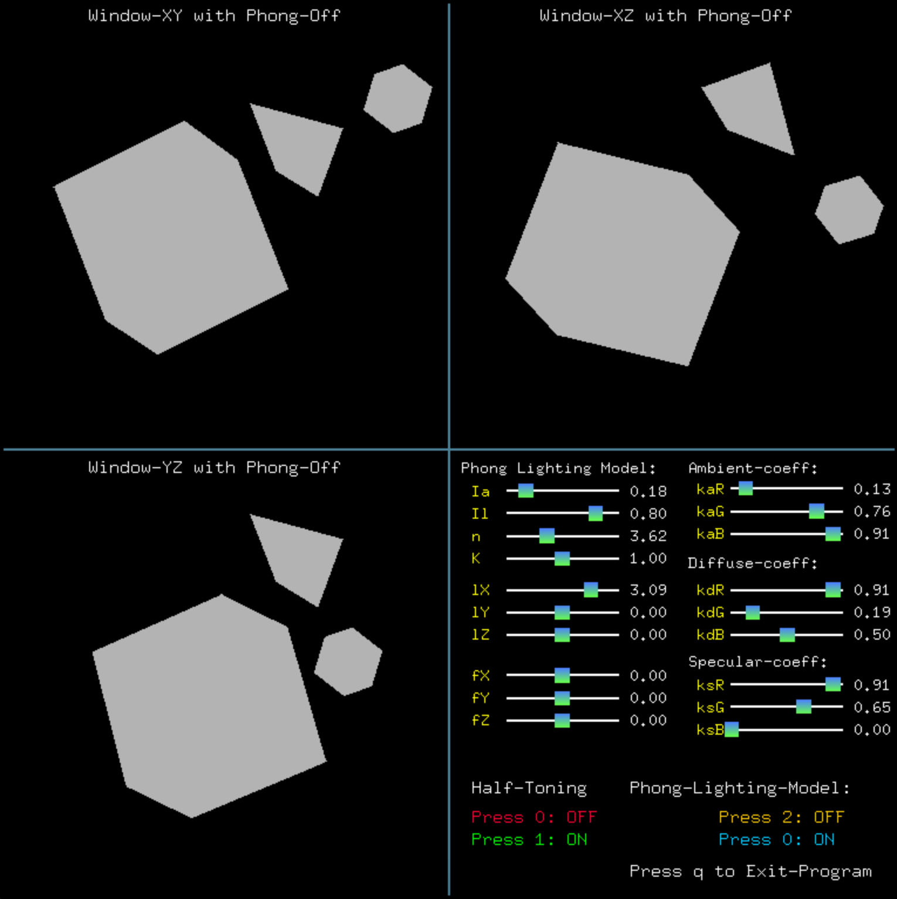

A+ Project

Window size: 
	width = 770
	height = 770 
	
			User-Guide
 
	step(1): enter ==> " make " <== to compile

	step(2): enter ==> " ./a.out " <== to run the program

Default: Phong-Model(On) and half-Toning(Off).

Phong-Model:
	Press 0: ON
	Press 2: OFF
Half-Toning:
	Press 1: ON
	Press 0: OFF

If you turn on half-toning on phong-model (off) position, half-toning will display without any light intensity value.
If you turn on half-toning on phong-model(On) position, it will include light intensity. 

Use the cube button slide to change Phong-Model value.
	
			Slider Range
Phong-lighting-Model
	Ia: 	0 to 1
	Il: 	0 to 1
	n : 	0 to 10
	k : 	0 to 2
	
Light Position:
	lX: 	-6 to 6
	lY: 	-6 to 6
	lZ: 	-6 to 6

From Position:
	fX:	-6 to 6
	fY:	-6 to 6
	fZ:	-6 to 6

Ambient-coeff, Diffuse-coeff, Specular-coeff:
	Red: 	0 to 1
	Green:	0 to 1
	Blue:	0 to 1

Exit: When you press 'q' or 'Q', it will exit immediately. Thanks
	      
	      
